# Architecture Documentation

> Comprehensive system architecture guide for the Project Management Tool, covering design patterns, database schema, service interactions, and scalability considerations.

## Table of Contents

1. [System Overview](#system-overview)
2. [Architecture Patterns](#architecture-patterns)
3. [Backend Architecture](#backend-architecture)
4. [Frontend Architecture](#frontend-architecture)
5. [Database Design](#database-design)
6. [Service Layer](#service-layer)
7. [Real-time Communication](#real-time-communication)
8. [Security Architecture](#security-architecture)
9. [Caching Strategy](#caching-strategy)
10. [Search Architecture](#search-architecture)
11. [Scalability Considerations](#scalability-considerations)
12. [Deployment Architecture](#deployment-architecture)

---

## System Overview

### High-Level Architecture

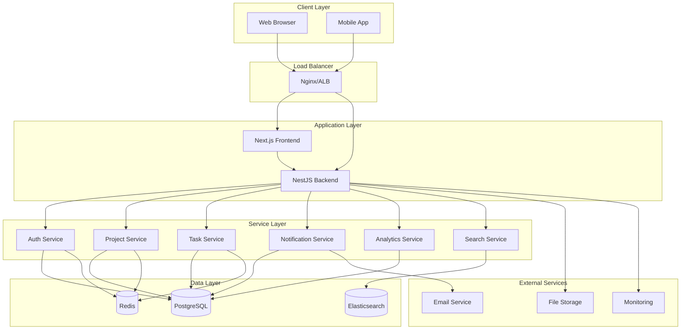

### Technology Stack

#### Backend Stack
- **Runtime**: Node.js 18+
- **Framework**: NestJS 10.x
- **Language**: TypeScript
- **Database**: PostgreSQL 15
- **ORM**: TypeORM
- **Cache**: Redis 7
- **Search**: Elasticsearch 8
- **Authentication**: JWT + Passport
- **Real-time**: Socket.IO
- **API**: REST + GraphQL
- **Documentation**: Swagger/OpenAPI

#### Frontend Stack
- **Framework**: Next.js 14
- **Language**: TypeScript
- **UI Library**: React 18
- **Styling**: Tailwind CSS
- **State Management**: React Context + Hooks
- **HTTP Client**: Axios
- **Real-time**: Socket.IO Client
- **Forms**: React Hook Form
- **Validation**: Zod

---

## Architecture Patterns

### 1. Modular Monolith

The application follows a modular monolith pattern with clear module boundaries:

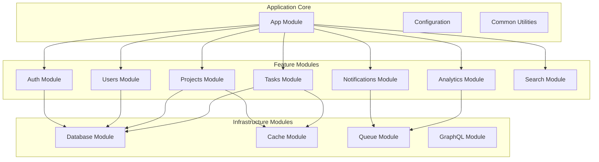

### 2. Layered Architecture

Each module follows a layered architecture pattern:

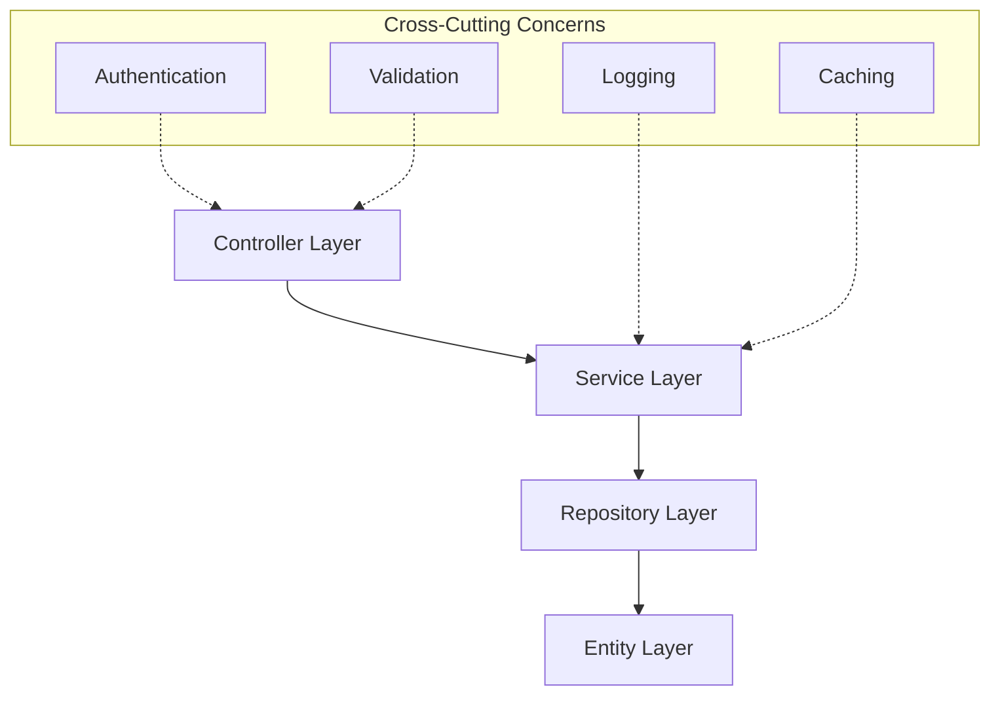

### 3. Domain-Driven Design (DDD)

The application incorporates DDD principles:

- **Entities**: Core business objects (User, Project, Task)
- **Value Objects**: Immutable objects (TaskStatus, Priority)
- **Aggregates**: Consistency boundaries (Project + Tasks)
- **Services**: Business logic coordination
- **Repositories**: Data access abstraction

---

## Backend Architecture

### Module Structure

```
backend/src/
├── app.module.ts              # Root module
├── main.ts                    # Application bootstrap
├── config/                    # Configuration management
│   └── configuration.ts
├── modules/
│   ├── auth/                  # Authentication & Authorization
│   │   ├── auth.controller.ts
│   │   ├── auth.service.ts
│   │   ├── auth.module.ts
│   │   ├── strategies/        # Passport strategies
│   │   └── guards/           # Auth guards
│   ├── users/                # User management
│   │   ├── user.entity.ts
│   │   ├── users.controller.ts
│   │   ├── users.service.ts
│   │   └── users.module.ts
│   ├── projects/             # Project management
│   │   ├── project.entity.ts
│   │   ├── projects.controller.ts
│   │   ├── projects.service.ts
│   │   ├── projects.module.ts
│   │   └── dto/              # Data transfer objects
│   ├── tasks/                # Task management
│   │   ├── task.entity.ts
│   │   ├── task-dependency.entity.ts
│   │   ├── tasks.controller.ts
│   │   ├── tasks.service.ts
│   │   ├── tasks.module.ts
│   │   └── dto/
│   ├── notifications/        # Real-time notifications
│   │   ├── notification.entity.ts
│   │   ├── notifications.gateway.ts
│   │   ├── notifications.service.ts
│   │   └── notifications.module.ts
│   ├── analytics/           # Analytics & reporting
│   │   ├── analytics.controller.ts
│   │   ├── analytics.service.ts
│   │   └── analytics.module.ts
│   ├── search/              # Elasticsearch integration
│   │   ├── search.controller.ts
│   │   ├── search.service.ts
│   │   ├── search.module.ts
│   │   └── elasticsearch.module.ts
│   ├── cache/               # Redis caching
│   │   ├── cache.service.ts
│   │   └── cache.module.ts
│   └── graphql/             # GraphQL resolvers
│       ├── graphql.module.ts
│       ├── inputs/
│       └── resolvers/
└── schema.gql               # GraphQL schema
```

### Dependency Injection

NestJS uses dependency injection for loose coupling:

```typescript
@Injectable()
export class TasksService {
  constructor(
    @InjectRepository(Task)
    private tasksRepository: Repository<Task>,
    @InjectRepository(TaskDependency)
    private dependencyRepository: Repository<TaskDependency>,
    private cacheService: CacheService,
    private notificationsService: NotificationsService,
  ) {}
}
```

### Request Lifecycle

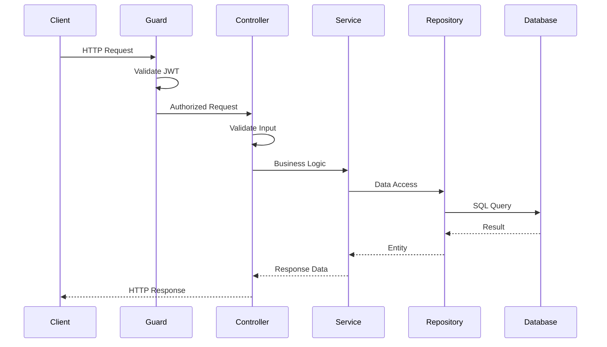

---

## Frontend Architecture

### Component Structure

```
frontend/
├── components/               # Reusable components
│   ├── ui/                  # Base UI components
│   │   ├── button.tsx
│   │   ├── input.tsx
│   │   ├── card.tsx
│   │   └── badge.tsx
│   ├── Layout.tsx           # Main layout component
│   ├── LoginForm.tsx        # Authentication forms
│   ├── SignupForm.tsx
│   └── ProtectedRoute.tsx   # Route protection
├── contexts/                # React contexts
│   ├── AuthContext.tsx      # Authentication state
│   └── NotificationContext.tsx # Real-time notifications
├── lib/                     # Utilities and API
│   ├── api.ts              # API client
│   └── utils.ts            # Helper functions
├── pages/                   # Next.js pages
│   ├── _app.tsx            # App wrapper
│   ├── index.tsx           # Home page
│   ├── login.tsx           # Login page
│   ├── projects.tsx        # Projects page
│   └── tasks.tsx           # Tasks page
└── styles/                  # Global styles
    └── globals.css
```

### State Management

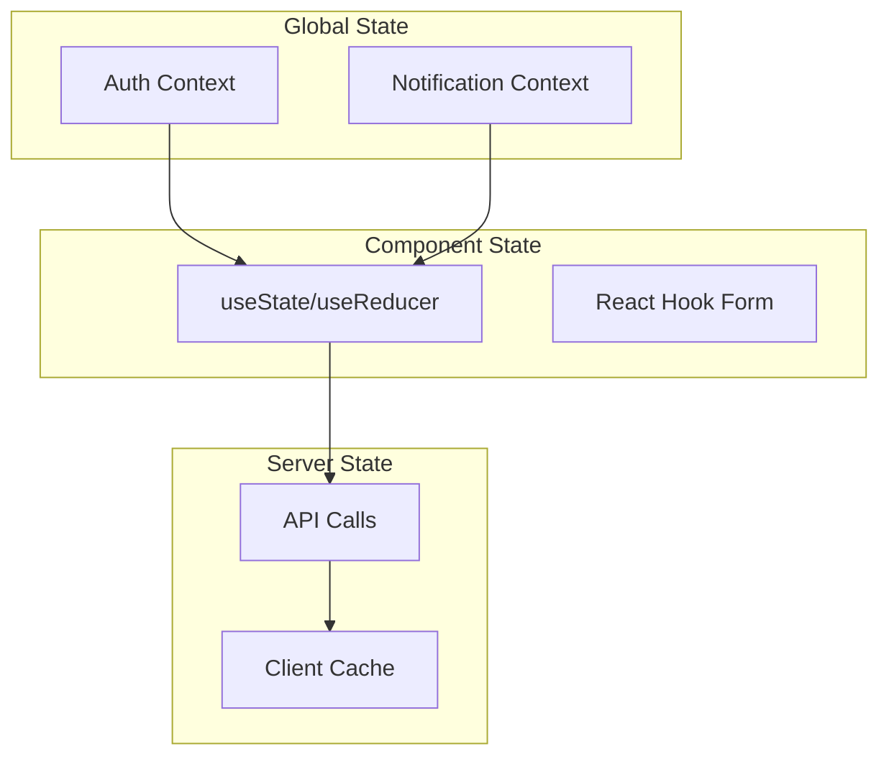

### Component Communication

```typescript
// Context Provider Pattern
const AuthContext = createContext<AuthContextType | undefined>(undefined);

export const AuthProvider: React.FC<{ children: ReactNode }> = ({ children }) => {
  const [user, setUser] = useState<User | null>(null);
  const [loading, setLoading] = useState(true);
  
  // Authentication logic...
  
  return (
    <AuthContext.Provider value={{ user, login, logout, loading }}>
      {children}
    </AuthContext.Provider>
  );
};

// Custom Hook
export const useAuth = () => {
  const context = useContext(AuthContext);
  if (!context) {
    throw new Error('useAuth must be used within AuthProvider');
  }
  return context;
};
```

---

## Database Design

### Entity Relationship Diagram

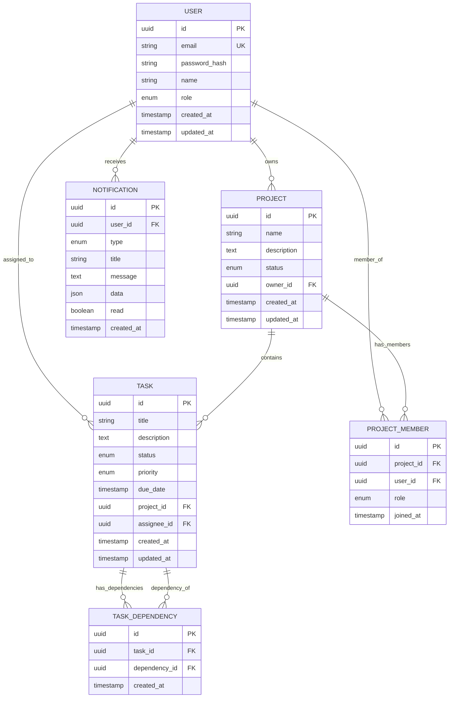

### Database Schema (DDL)

```sql
-- Users table
CREATE TABLE users (
    id UUID PRIMARY KEY DEFAULT gen_random_uuid(),
    email VARCHAR(255) UNIQUE NOT NULL,
    password_hash VARCHAR(255) NOT NULL,
    name VARCHAR(100) NOT NULL,
    role VARCHAR(20) DEFAULT 'USER' CHECK (role IN ('ADMIN', 'USER')),
    created_at TIMESTAMP WITH TIME ZONE DEFAULT NOW(),
    updated_at TIMESTAMP WITH TIME ZONE DEFAULT NOW()
);

-- Projects table
CREATE TABLE projects (
    id UUID PRIMARY KEY DEFAULT gen_random_uuid(),
    name VARCHAR(255) NOT NULL,
    description TEXT,
    status VARCHAR(20) DEFAULT 'ACTIVE' CHECK (status IN ('ACTIVE', 'COMPLETED', 'ARCHIVED')),
    owner_id UUID NOT NULL REFERENCES users(id) ON DELETE CASCADE,
    created_at TIMESTAMP WITH TIME ZONE DEFAULT NOW(),
    updated_at TIMESTAMP WITH TIME ZONE DEFAULT NOW()
);

-- Tasks table
CREATE TABLE tasks (
    id UUID PRIMARY KEY DEFAULT gen_random_uuid(),
    title VARCHAR(255) NOT NULL,
    description TEXT,
    status VARCHAR(20) DEFAULT 'TODO' CHECK (status IN ('TODO', 'IN_PROGRESS', 'DONE')),
    priority VARCHAR(10) DEFAULT 'MEDIUM' CHECK (priority IN ('LOW', 'MEDIUM', 'HIGH')),
    due_date TIMESTAMP WITH TIME ZONE,
    project_id UUID NOT NULL REFERENCES projects(id) ON DELETE CASCADE,
    assignee_id UUID REFERENCES users(id) ON DELETE SET NULL,
    created_at TIMESTAMP WITH TIME ZONE DEFAULT NOW(),
    updated_at TIMESTAMP WITH TIME ZONE DEFAULT NOW()
);

-- Task dependencies table
CREATE TABLE task_dependencies (
    id UUID PRIMARY KEY DEFAULT gen_random_uuid(),
    task_id UUID NOT NULL REFERENCES tasks(id) ON DELETE CASCADE,
    dependency_id UUID NOT NULL REFERENCES tasks(id) ON DELETE CASCADE,
    created_at TIMESTAMP WITH TIME ZONE DEFAULT NOW(),
    UNIQUE(task_id, dependency_id),
    CHECK (task_id != dependency_id)
);

-- Project members table
CREATE TABLE project_members (
    id UUID PRIMARY KEY DEFAULT gen_random_uuid(),
    project_id UUID NOT NULL REFERENCES projects(id) ON DELETE CASCADE,
    user_id UUID NOT NULL REFERENCES users(id) ON DELETE CASCADE,
    role VARCHAR(20) DEFAULT 'MEMBER' CHECK (role IN ('OWNER', 'ADMIN', 'MEMBER')),
    joined_at TIMESTAMP WITH TIME ZONE DEFAULT NOW(),
    UNIQUE(project_id, user_id)
);

-- Notifications table
CREATE TABLE notifications (
    id UUID PRIMARY KEY DEFAULT gen_random_uuid(),
    user_id UUID NOT NULL REFERENCES users(id) ON DELETE CASCADE,
    type VARCHAR(50) NOT NULL,
    title VARCHAR(255) NOT NULL,
    message TEXT NOT NULL,
    data JSONB,
    read BOOLEAN DEFAULT FALSE,
    created_at TIMESTAMP WITH TIME ZONE DEFAULT NOW()
);

-- Indexes for performance
CREATE INDEX idx_projects_owner_id ON projects(owner_id);
CREATE INDEX idx_projects_status ON projects(status);
CREATE INDEX idx_tasks_project_id ON tasks(project_id);
CREATE INDEX idx_tasks_assignee_id ON tasks(assignee_id);
CREATE INDEX idx_tasks_status ON tasks(status);
CREATE INDEX idx_tasks_due_date ON tasks(due_date);
CREATE INDEX idx_task_dependencies_task_id ON task_dependencies(task_id);
CREATE INDEX idx_task_dependencies_dependency_id ON task_dependencies(dependency_id);
CREATE INDEX idx_project_members_project_id ON project_members(project_id);
CREATE INDEX idx_project_members_user_id ON project_members(user_id);
CREATE INDEX idx_notifications_user_id ON notifications(user_id);
CREATE INDEX idx_notifications_read ON notifications(read);
CREATE INDEX idx_notifications_created_at ON notifications(created_at DESC);
```

### Data Access Patterns

#### Repository Pattern
```typescript
@Injectable()
export class TasksService {
  constructor(
    @InjectRepository(Task)
    private tasksRepository: Repository<Task>,
  ) {}
  
  async findTasksWithDependencies(projectId: string): Promise<Task[]> {
    return this.tasksRepository.find({
      where: { project: { id: projectId } },
      relations: ['dependencies', 'dependents', 'assignee'],
      order: { createdAt: 'DESC' }
    });
  }
}
```

#### Query Optimization
```typescript
// Efficient topological sorting query
async getTasksTopologicalOrder(projectId: string): Promise<Task[]> {
  const query = `
    WITH RECURSIVE task_levels AS (
      -- Base case: tasks with no dependencies
      SELECT t.id, t.title, 0 as level
      FROM tasks t
      LEFT JOIN task_dependencies td ON t.id = td.task_id
      WHERE t.project_id = $1 AND td.task_id IS NULL
      
      UNION ALL
      
      -- Recursive case: tasks depending on previous level
      SELECT t.id, t.title, tl.level + 1
      FROM tasks t
      JOIN task_dependencies td ON t.id = td.task_id
      JOIN task_levels tl ON td.dependency_id = tl.id
      WHERE t.project_id = $1
    )
    SELECT * FROM task_levels ORDER BY level, title;
  `;
  
  return this.tasksRepository.query(query, [projectId]);
}
```

---

## Service Layer

### Service Architecture

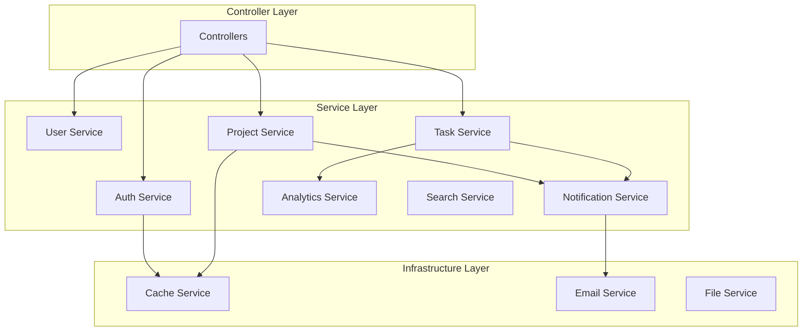

### Business Logic Implementation

#### Task Dependency Management
```typescript
@Injectable()
export class TasksService {
  async addDependency(taskId: string, dependencyId: string): Promise<void> {
    // Check for circular dependencies
    const wouldCreateCycle = await this.checkCircularDependency(taskId, dependencyId);
    if (wouldCreateCycle) {
      throw new BadRequestException('Adding this dependency would create a circular reference');
    }
    
    // Add dependency
    const dependency = this.dependencyRepository.create({
      taskId,
      dependencyId
    });
    
    await this.dependencyRepository.save(dependency);
    
    // Notify affected users
    await this.notificationsService.notifyDependencyAdded(taskId, dependencyId);
  }
  
  private async checkCircularDependency(taskId: string, dependencyId: string): Promise<boolean> {
    // Implement cycle detection using DFS
    const visited = new Set<string>();
    const recursionStack = new Set<string>();
    
    return this.hasCycleDFS(dependencyId, taskId, visited, recursionStack);
  }
}
```

#### Topological Sorting Algorithm
```typescript
async getTopologicalOrder(projectId: string): Promise<Task[]> {
  const tasks = await this.findTasksWithDependencies(projectId);
  const graph = this.buildDependencyGraph(tasks);
  
  // Kahn's algorithm for topological sorting
  const inDegree = new Map<string, number>();
  const queue: string[] = [];
  const result: Task[] = [];
  
  // Initialize in-degrees
  tasks.forEach(task => {
    inDegree.set(task.id, 0);
  });
  
  // Calculate in-degrees
  graph.forEach((dependencies, taskId) => {
    dependencies.forEach(depId => {
      inDegree.set(depId, (inDegree.get(depId) || 0) + 1);
    });
  });
  
  // Find tasks with no dependencies
  inDegree.forEach((degree, taskId) => {
    if (degree === 0) {
      queue.push(taskId);
    }
  });
  
  // Process queue
  while (queue.length > 0) {
    const taskId = queue.shift()!;
    const task = tasks.find(t => t.id === taskId)!;
    result.push(task);
    
    // Update in-degrees of dependent tasks
    const dependencies = graph.get(taskId) || [];
    dependencies.forEach(depId => {
      const newDegree = inDegree.get(depId)! - 1;
      inDegree.set(depId, newDegree);
      
      if (newDegree === 0) {
        queue.push(depId);
      }
    });
  }
  
  // Check for cycles
  if (result.length !== tasks.length) {
    throw new BadRequestException('Circular dependency detected in project tasks');
  }
  
  return result;
}
```

---

## Real-time Communication

### WebSocket Architecture

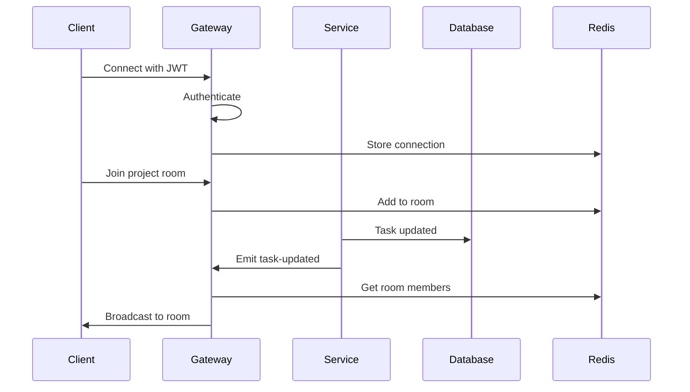

### Notification Gateway Implementation

```typescript
@WebSocketGateway({
  cors: {
    origin: process.env.FRONTEND_URL,
    credentials: true,
  },
  transports: ['websocket', 'polling'],
})
export class NotificationsGateway implements OnGatewayConnection, OnGatewayDisconnect {
  @WebSocketServer()
  server: Server;
  
  constructor(
    private jwtService: JwtService,
    private cacheService: CacheService,
  ) {}
  
  async handleConnection(client: Socket) {
    try {
      const token = client.handshake.query.token as string;
      const payload = this.jwtService.verify(token);
      
      client.data.userId = payload.sub;
      await this.cacheService.set(`socket:${client.id}`, payload.sub, 3600);
      
      console.log(`User ${payload.sub} connected: ${client.id}`);
    } catch (error) {
      client.disconnect();
    }
  }
  
  async handleDisconnect(client: Socket) {
    await this.cacheService.del(`socket:${client.id}`);
    console.log(`Client disconnected: ${client.id}`);
  }
  
  @SubscribeMessage('join-project')
  async handleJoinProject(client: Socket, data: { projectId: string }) {
    await client.join(`project:${data.projectId}`);
    console.log(`User ${client.data.userId} joined project ${data.projectId}`);
  }
  
  async notifyProjectMembers(projectId: string, event: string, data: any) {
    this.server.to(`project:${projectId}`).emit(event, data);
  }
}
```

---

## Security Architecture

### Authentication Flow

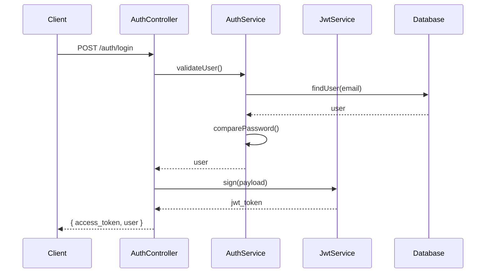

### Authorization Guards

```typescript
@Injectable()
export class JwtAuthGuard extends AuthGuard('jwt') {
  canActivate(context: ExecutionContext): boolean | Promise<boolean> {
    return super.canActivate(context);
  }
  
  handleRequest(err: any, user: any, info: any) {
    if (err || !user) {
      throw err || new UnauthorizedException();
    }
    return user;
  }
}

@Injectable()
export class RolesGuard implements CanActivate {
  constructor(private reflector: Reflector) {}
  
  canActivate(context: ExecutionContext): boolean {
    const requiredRoles = this.reflector.getAllAndOverride<Role[]>(ROLES_KEY, [
      context.getHandler(),
      context.getClass(),
    ]);
    
    if (!requiredRoles) {
      return true;
    }
    
    const { user } = context.switchToHttp().getRequest();
    return requiredRoles.some((role) => user.role === role);
  }
}
```

### Security Middleware

```typescript
// Rate limiting
@Injectable()
export class RateLimitGuard implements CanActivate {
  constructor(private cacheService: CacheService) {}
  
  async canActivate(context: ExecutionContext): Promise<boolean> {
    const request = context.switchToHttp().getRequest();
    const key = `rate_limit:${request.ip}:${request.route.path}`;
    
    const current = await this.cacheService.get(key);
    if (current && parseInt(current) >= 100) {
      throw new HttpException('Too Many Requests', HttpStatus.TOO_MANY_REQUESTS);
    }
    
    await this.cacheService.incr(key, 60); // 100 requests per minute
    return true;
  }
}
```

---

## Caching Strategy

### Multi-Level Caching

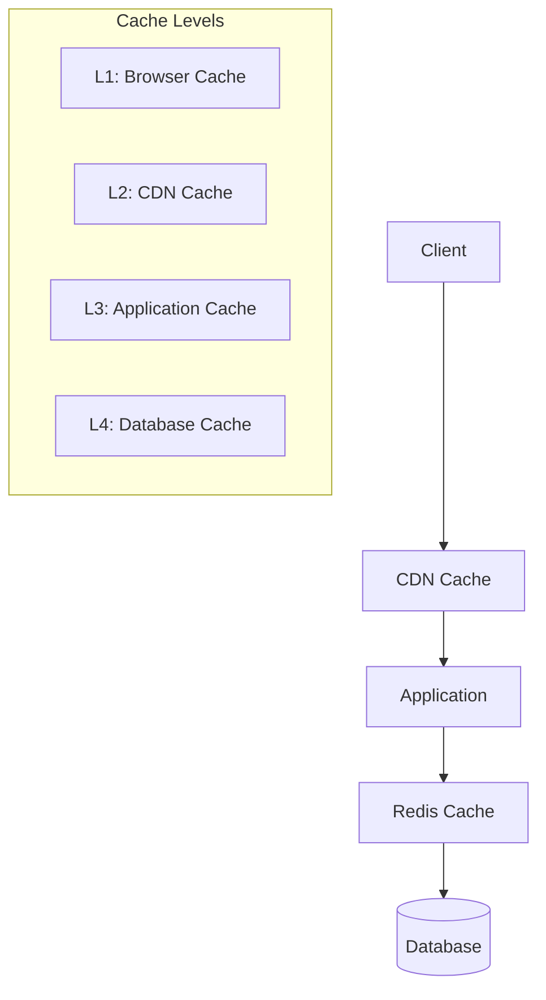

### Cache Implementation

```typescript
@Injectable()
export class CacheService {
  constructor(
    @Inject(CACHE_MANAGER)
    private cacheManager: Cache,
  ) {}
  
  async get<T>(key: string): Promise<T | null> {
    return this.cacheManager.get(key);
  }
  
  async set(key: string, value: any, ttl: number = 3600): Promise<void> {
    await this.cacheManager.set(key, value, ttl);
  }
  
  async del(key: string): Promise<void> {
    await this.cacheManager.del(key);
  }
  
  async invalidatePattern(pattern: string): Promise<void> {
    // Implement pattern-based cache invalidation
    const keys = await this.cacheManager.store.keys(pattern);
    await Promise.all(keys.map(key => this.cacheManager.del(key)));
  }
}

// Cache decorator
export function Cacheable(ttl: number = 3600) {
  return function (target: any, propertyName: string, descriptor: PropertyDescriptor) {
    const method = descriptor.value;
    
    descriptor.value = async function (...args: any[]) {
      const cacheKey = `${target.constructor.name}:${propertyName}:${JSON.stringify(args)}`;
      const cacheService = this.cacheService;
      
      let result = await cacheService.get(cacheKey);
      if (!result) {
        result = await method.apply(this, args);
        await cacheService.set(cacheKey, result, ttl);
      }
      
      return result;
    };
  };
}
```

---

## Search Architecture

### Elasticsearch Integration

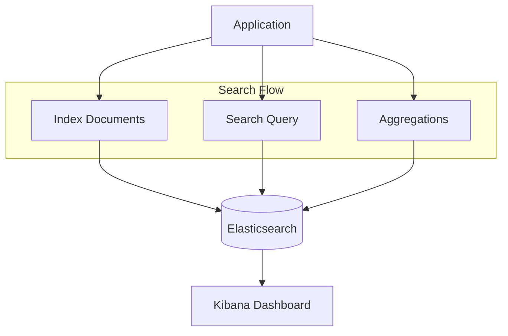

### Search Service Implementation

```typescript
@Injectable()
export class SearchService {
  constructor(
    @Inject('ELASTICSEARCH_CLIENT')
    private elasticsearchClient: Client,
  ) {}
  
  async indexProject(project: Project): Promise<void> {
    await this.elasticsearchClient.index({
      index: 'projects',
      id: project.id,
      body: {
        name: project.name,
        description: project.description,
        status: project.status,
        owner: project.owner.name,
        created_at: project.createdAt,
        tags: project.tags,
      },
    });
  }
  
  async searchProjects(query: string, filters: any = {}): Promise<any> {
    const searchQuery = {
      index: 'projects',
      body: {
        query: {
          bool: {
            must: [
              {
                multi_match: {
                  query,
                  fields: ['name^2', 'description', 'owner'],
                  fuzziness: 'AUTO',
                },
              },
            ],
            filter: Object.entries(filters).map(([key, value]) => ({
              term: { [key]: value },
            })),
          },
        },
        highlight: {
          fields: {
            name: {},
            description: {},
          },
        },
        sort: [{ _score: { order: 'desc' } }],
      },
    };
    
    return this.elasticsearchClient.search(searchQuery);
  }
}
```

---

## Scalability Considerations

### Horizontal Scaling

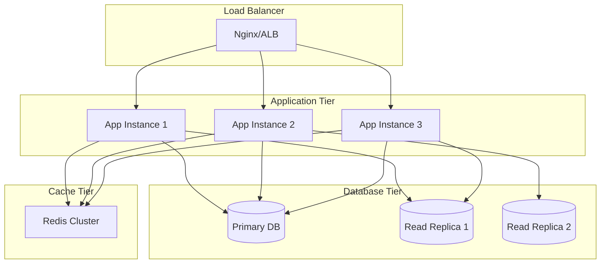

### Performance Optimization

#### Database Optimization
- **Connection Pooling**: Efficient database connection management
- **Query Optimization**: Proper indexing and query structure
- **Read Replicas**: Separate read and write operations
- **Partitioning**: Horizontal table partitioning for large datasets

#### Application Optimization
- **Caching**: Multi-level caching strategy
- **Lazy Loading**: Load data only when needed
- **Pagination**: Limit data transfer
- **Compression**: Gzip compression for API responses

#### Frontend Optimization
- **Code Splitting**: Dynamic imports for route-based splitting
- **Image Optimization**: Next.js Image component
- **Static Generation**: Pre-render pages when possible
- **CDN**: Content delivery network for static assets

---

## Deployment Architecture

### Container Orchestration

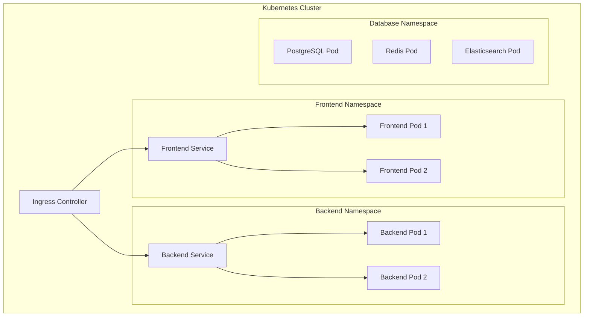

### CI/CD Pipeline

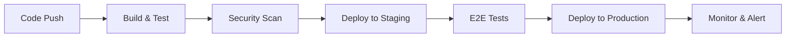

### Monitoring & Observability

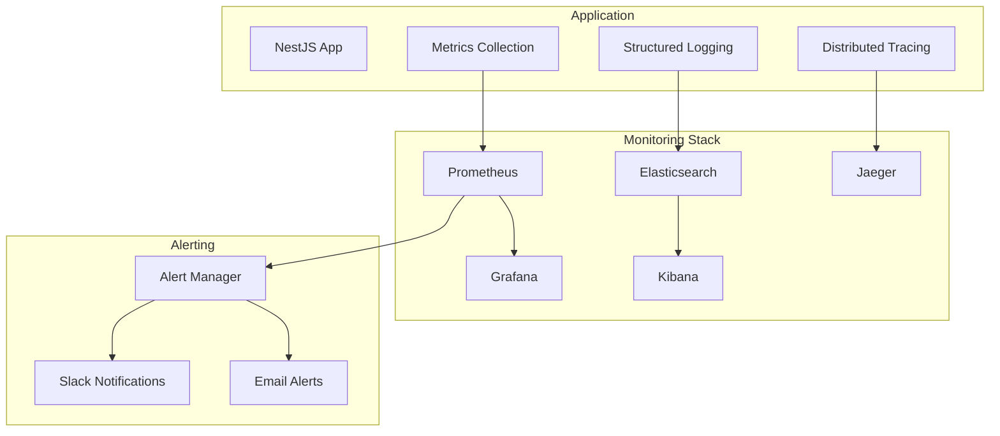

This comprehensive architecture documentation provides a complete understanding of the system design, enabling developers to effectively work with and extend the Project Management Tool.