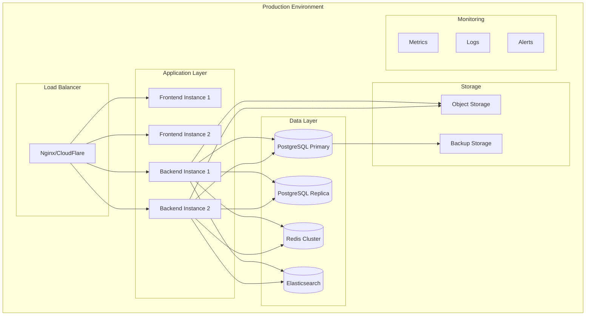

# Production Deployment Guide

> Complete guide for deploying the Project Management Tool to production environments, covering cloud platforms, containerization, monitoring, and best practices.

## Table of Contents

1. [Deployment Overview](#deployment-overview)
2. [Environment Setup](#environment-setup)
3. [Docker Production Deployment](#docker-production-deployment)
4. [Cloud Platform Deployments](#cloud-platform-deployments)
5. [Database Setup](#database-setup)
6. [SSL/TLS Configuration](#ssltls-configuration)
7. [Monitoring & Logging](#monitoring--logging)
8. [CI/CD Pipeline](#cicd-pipeline)
9. [Performance Optimization](#performance-optimization)
10. [Security Hardening](#security-hardening)
11. [Backup & Recovery](#backup--recovery)
12. [Troubleshooting](#troubleshooting)

---

## Deployment Overview

### Architecture Components



### Deployment Strategies

1. **Blue-Green Deployment**: Zero-downtime deployments
2. **Rolling Updates**: Gradual instance replacement
3. **Canary Deployment**: Gradual traffic shifting
4. **Feature Flags**: Runtime feature control

---

## Environment Setup

### Production Environment Variables

Create a comprehensive `.env.production` file:

```env
# Application Configuration
NODE_ENV=production
PORT=3001
API_PREFIX=api
API_VERSION=v1

# Database Configuration
DB_HOST=your-postgres-host.com
DB_PORT=5432
DB_USER=pmtool_user
DB_PASSWORD=your-secure-password
DB_NAME=pmtool_production
DB_SSL=true
DB_POOL_SIZE=20
DB_CONNECTION_TIMEOUT=60000

# Redis Configuration
REDIS_HOST=your-redis-host.com
REDIS_PORT=6379
REDIS_PASSWORD=your-redis-password
REDIS_DB=0
REDIS_CLUSTER_MODE=true

# Elasticsearch Configuration
ELASTICSEARCH_NODE=https://your-elasticsearch-host.com:9200
ELASTICSEARCH_USERNAME=elastic
ELASTICSEARCH_PASSWORD=your-elastic-password
ELASTICSEARCH_INDEX_PREFIX=pmtool_prod

# Security Configuration
JWT_SECRET=your-super-secure-jwt-secret-256-bits-minimum
JWT_EXPIRES_IN=7d
JWT_REFRESH_SECRET=your-refresh-token-secret
JWT_REFRESH_EXPIRES_IN=30d
BCRYPT_ROUNDS=12

# CORS Configuration
CORS_ORIGIN=https://your-frontend-domain.com
CORS_CREDENTIALS=true

# Rate Limiting
RATE_LIMIT_WINDOW=900000
RATE_LIMIT_MAX=100
RATE_LIMIT_SKIP_SUCCESS=true

# File Upload
MAX_FILE_SIZE=10485760
UPLOAD_DEST=./uploads

# External Services
AWS_REGION=us-east-1
AWS_ACCESS_KEY_ID=your-aws-access-key
AWS_SECRET_ACCESS_KEY=your-aws-secret-key
AWS_S3_BUCKET=pmtool-production-files

# Email Configuration
SMTP_HOST=smtp.gmail.com
SMTP_PORT=587
SMTP_SECURE=false
SMTP_USER=your-email@gmail.com
SMTP_PASS=your-app-password
EMAIL_FROM=noreply@yourcompany.com

# Monitoring
SENTRY_DSN=https://your-sentry-dsn@sentry.io/project-id
NEW_RELIC_LICENSE_KEY=your-newrelic-license-key
NEW_RELIC_APP_NAME=PMTool-Production

# Frontend Configuration
NEXT_PUBLIC_API_URL=https://api.yourcompany.com
NEXT_PUBLIC_WS_URL=https://api.yourcompany.com
NEXT_PUBLIC_SENTRY_DSN=https://your-frontend-sentry-dsn@sentry.io/project-id
NEXT_PUBLIC_GOOGLE_ANALYTICS_ID=GA_MEASUREMENT_ID

# SSL/TLS
SSL_CERT_PATH=/etc/ssl/certs/yourcompany.crt
SSL_KEY_PATH=/etc/ssl/private/yourcompany.key

# Logging
LOG_LEVEL=info
LOG_FORMAT=json
LOG_FILE_PATH=/var/log/pmtool/app.log
LOG_MAX_SIZE=100m
LOG_MAX_FILES=10
```

### Environment Validation

Create an environment validation script:

```typescript
// scripts/validate-env.ts
import { z } from 'zod';

const envSchema = z.object({
  NODE_ENV: z.enum(['development', 'production', 'test']),
  PORT: z.string().transform(Number),
  DB_HOST: z.string().min(1),
  DB_PASSWORD: z.string().min(8),
  JWT_SECRET: z.string().min(32),
  REDIS_HOST: z.string().min(1),
  // Add all required environment variables
});

function validateEnvironment() {
  try {
    envSchema.parse(process.env);
    console.log('✅ Environment validation passed');
  } catch (error) {
    console.error('❌ Environment validation failed:', error.errors);
    process.exit(1);
  }
}

validateEnvironment();
```

---

## Docker Production Deployment

### Production Dockerfile (Backend)

```dockerfile
# backend/Dockerfile.prod
FROM node:18-alpine AS builder

# Install dependencies for native modules
RUN apk add --no-cache python3 make g++

WORKDIR /app

# Copy package files
COPY package*.json ./
COPY tsconfig*.json ./

# Install dependencies
RUN npm ci --only=production && npm cache clean --force

# Copy source code
COPY src/ ./src/

# Build application
RUN npm run build

# Production stage
FROM node:18-alpine AS production

# Create non-root user
RUN addgroup -g 1001 -S nodejs
RUN adduser -S nestjs -u 1001

WORKDIR /app

# Copy built application
COPY --from=builder --chown=nestjs:nodejs /app/dist ./dist
COPY --from=builder --chown=nestjs:nodejs /app/node_modules ./node_modules
COPY --from=builder --chown=nestjs:nodejs /app/package*.json ./

# Create logs directory
RUN mkdir -p /var/log/pmtool && chown nestjs:nodejs /var/log/pmtool

# Switch to non-root user
USER nestjs

# Health check
HEALTHCHECK --interval=30s --timeout=3s --start-period=5s --retries=3 \
  CMD curl -f http://localhost:3001/api/health || exit 1

EXPOSE 3001

CMD ["node", "dist/main.js"]
```

### Production Dockerfile (Frontend)

```dockerfile
# frontend/Dockerfile.prod
FROM node:18-alpine AS builder

WORKDIR /app

# Copy package files
COPY package*.json ./
COPY next.config.js ./
COPY tsconfig.json ./
COPY tailwind.config.js ./
COPY postcss.config.js ./

# Install dependencies
RUN npm ci --only=production

# Copy source code
COPY components/ ./components/
COPY contexts/ ./contexts/
COPY lib/ ./lib/
COPY pages/ ./pages/
COPY styles/ ./styles/
COPY public/ ./public/

# Build application
RUN npm run build

# Production stage
FROM node:18-alpine AS production

# Create non-root user
RUN addgroup -g 1001 -S nodejs
RUN adduser -S nextjs -u 1001

WORKDIR /app

# Copy built application
COPY --from=builder --chown=nextjs:nodejs /app/.next/standalone ./
COPY --from=builder --chown=nextjs:nodejs /app/.next/static ./.next/static
COPY --from=builder --chown=nextjs:nodejs /app/public ./public

# Switch to non-root user
USER nextjs

EXPOSE 3000

CMD ["node", "server.js"]
```

### Production Docker Compose

```yaml
# docker-compose.prod.yml
version: '3.8'

services:
  nginx:
    image: nginx:alpine
    ports:
      - "80:80"
      - "443:443"
    volumes:
      - ./nginx/nginx.conf:/etc/nginx/nginx.conf:ro
      - ./ssl:/etc/ssl:ro
      - ./logs/nginx:/var/log/nginx
    depends_on:
      - frontend
      - backend
    restart: unless-stopped
    networks:
      - pmtool-network

  frontend:
    build:
      context: ./frontend
      dockerfile: Dockerfile.prod
    environment:
      - NODE_ENV=production
    deploy:
      replicas: 2
      resources:
        limits:
          memory: 512M
          cpus: '0.5'
        reservations:
          memory: 256M
          cpus: '0.25'
    restart: unless-stopped
    networks:
      - pmtool-network

  backend:
    build:
      context: ./backend
      dockerfile: Dockerfile.prod
    environment:
      - NODE_ENV=production
    env_file:
      - .env.production
    volumes:
      - ./logs/backend:/var/log/pmtool
      - ./uploads:/app/uploads
    deploy:
      replicas: 2
      resources:
        limits:
          memory: 1G
          cpus: '1.0'
        reservations:
          memory: 512M
          cpus: '0.5'
    restart: unless-stopped
    networks:
      - pmtool-network
    depends_on:
      - postgres
      - redis
      - elasticsearch

  postgres:
    image: postgres:15-alpine
    environment:
      POSTGRES_DB: pmtool_production
      POSTGRES_USER: pmtool_user
      POSTGRES_PASSWORD: ${DB_PASSWORD}
    volumes:
      - postgres_data:/var/lib/postgresql/data
      - ./backups:/backups
      - ./scripts/init-db.sql:/docker-entrypoint-initdb.d/init-db.sql:ro
    deploy:
      resources:
        limits:
          memory: 2G
          cpus: '1.0'
    restart: unless-stopped
    networks:
      - pmtool-network

  redis:
    image: redis:7-alpine
    command: redis-server --requirepass ${REDIS_PASSWORD} --maxmemory 256mb --maxmemory-policy allkeys-lru
    volumes:
      - redis_data:/data
    deploy:
      resources:
        limits:
          memory: 512M
          cpus: '0.5'
    restart: unless-stopped
    networks:
      - pmtool-network

  elasticsearch:
    image: docker.elastic.co/elasticsearch/elasticsearch:8.11.0
    environment:
      - discovery.type=single-node
      - "ES_JAVA_OPTS=-Xms512m -Xmx512m"
      - xpack.security.enabled=true
      - ELASTIC_PASSWORD=${ELASTICSEARCH_PASSWORD}
    volumes:
      - elasticsearch_data:/usr/share/elasticsearch/data
    deploy:
      resources:
        limits:
          memory: 1G
          cpus: '1.0'
    restart: unless-stopped
    networks:
      - pmtool-network

volumes:
  postgres_data:
  redis_data:
  elasticsearch_data:

networks:
  pmtool-network:
    driver: bridge
```

### Nginx Configuration

```nginx
# nginx/nginx.conf
events {
    worker_connections 1024;
}

http {
    upstream frontend {
        server frontend:3000;
    }
    
    upstream backend {
        server backend:3001;
    }
    
    # Rate limiting
    limit_req_zone $binary_remote_addr zone=api:10m rate=10r/s;
    limit_req_zone $binary_remote_addr zone=login:10m rate=1r/s;
    
    # SSL Configuration
    ssl_protocols TLSv1.2 TLSv1.3;
    ssl_ciphers ECDHE-RSA-AES256-GCM-SHA512:DHE-RSA-AES256-GCM-SHA512:ECDHE-RSA-AES256-GCM-SHA384:DHE-RSA-AES256-GCM-SHA384;
    ssl_prefer_server_ciphers off;
    ssl_session_cache shared:SSL:10m;
    ssl_session_timeout 10m;
    
    # Security Headers
    add_header X-Frame-Options DENY;
    add_header X-Content-Type-Options nosniff;
    add_header X-XSS-Protection "1; mode=block";
    add_header Strict-Transport-Security "max-age=31536000; includeSubDomains" always;
    
    # Gzip Compression
    gzip on;
    gzip_vary on;
    gzip_min_length 1024;
    gzip_types text/plain text/css text/xml text/javascript application/javascript application/xml+rss application/json;
    
    # Frontend Server
    server {
        listen 80;
        server_name yourcompany.com www.yourcompany.com;
        return 301 https://$server_name$request_uri;
    }
    
    server {
        listen 443 ssl http2;
        server_name yourcompany.com www.yourcompany.com;
        
        ssl_certificate /etc/ssl/yourcompany.crt;
        ssl_certificate_key /etc/ssl/yourcompany.key;
        
        location / {
            proxy_pass http://frontend;
            proxy_http_version 1.1;
            proxy_set_header Upgrade $http_upgrade;
            proxy_set_header Connection 'upgrade';
            proxy_set_header Host $host;
            proxy_set_header X-Real-IP $remote_addr;
            proxy_set_header X-Forwarded-For $proxy_add_x_forwarded_for;
            proxy_set_header X-Forwarded-Proto $scheme;
            proxy_cache_bypass $http_upgrade;
        }
    }
    
    # API Server
    server {
        listen 80;
        server_name api.yourcompany.com;
        return 301 https://$server_name$request_uri;
    }
    
    server {
        listen 443 ssl http2;
        server_name api.yourcompany.com;
        
        ssl_certificate /etc/ssl/yourcompany.crt;
        ssl_certificate_key /etc/ssl/yourcompany.key;
        
        # API Rate Limiting
        location /api/auth/login {
            limit_req zone=login burst=5 nodelay;
            proxy_pass http://backend;
            include /etc/nginx/proxy_params;
        }
        
        location /api/ {
            limit_req zone=api burst=20 nodelay;
            proxy_pass http://backend;
            include /etc/nginx/proxy_params;
        }
        
        # WebSocket Support
        location /socket.io/ {
            proxy_pass http://backend;
            proxy_http_version 1.1;
            proxy_set_header Upgrade $http_upgrade;
            proxy_set_header Connection "upgrade";
            proxy_set_header Host $host;
            proxy_set_header X-Real-IP $remote_addr;
            proxy_set_header X-Forwarded-For $proxy_add_x_forwarded_for;
            proxy_set_header X-Forwarded-Proto $scheme;
        }
    }
}
```

---

## Cloud Platform Deployments

### AWS Deployment

#### ECS with Fargate

```yaml
# aws/ecs-task-definition.json
{
  "family": "pmtool-backend",
  "networkMode": "awsvpc",
  "requiresCompatibilities": ["FARGATE"],
  "cpu": "512",
  "memory": "1024",
  "executionRoleArn": "arn:aws:iam::account:role/ecsTaskExecutionRole",
  "taskRoleArn": "arn:aws:iam::account:role/ecsTaskRole",
  "containerDefinitions": [
    {
      "name": "pmtool-backend",
      "image": "your-account.dkr.ecr.region.amazonaws.com/pmtool-backend:latest",
      "portMappings": [
        {
          "containerPort": 3001,
          "protocol": "tcp"
        }
      ],
      "environment": [
        {
          "name": "NODE_ENV",
          "value": "production"
        }
      ],
      "secrets": [
        {
          "name": "DB_PASSWORD",
          "valueFrom": "arn:aws:secretsmanager:region:account:secret:pmtool/db-password"
        }
      ],
      "logConfiguration": {
        "logDriver": "awslogs",
        "options": {
          "awslogs-group": "/ecs/pmtool-backend",
          "awslogs-region": "us-east-1",
          "awslogs-stream-prefix": "ecs"
        }
      },
      "healthCheck": {
        "command": ["CMD-SHELL", "curl -f http://localhost:3001/api/health || exit 1"],
        "interval": 30,
        "timeout": 5,
        "retries": 3,
        "startPeriod": 60
      }
    }
  ]
}
```

#### Terraform Configuration

```hcl
# aws/main.tf
provider "aws" {
  region = var.aws_region
}

# VPC Configuration
resource "aws_vpc" "pmtool_vpc" {
  cidr_block           = "10.0.0.0/16"
  enable_dns_hostnames = true
  enable_dns_support   = true
  
  tags = {
    Name = "pmtool-vpc"
  }
}

# RDS Instance
resource "aws_db_instance" "pmtool_db" {
  identifier = "pmtool-production"
  
  engine         = "postgres"
  engine_version = "15.4"
  instance_class = "db.t3.micro"
  
  allocated_storage     = 20
  max_allocated_storage = 100
  storage_type          = "gp2"
  storage_encrypted     = true
  
  db_name  = "pmtool"
  username = "pmtool_user"
  password = var.db_password
  
  vpc_security_group_ids = [aws_security_group.rds.id]
  db_subnet_group_name   = aws_db_subnet_group.pmtool.name
  
  backup_retention_period = 7
  backup_window          = "03:00-04:00"
  maintenance_window     = "sun:04:00-sun:05:00"
  
  skip_final_snapshot = false
  final_snapshot_identifier = "pmtool-final-snapshot-${formatdate("YYYY-MM-DD-hhmm", timestamp())}"
  
  tags = {
    Name = "pmtool-database"
  }
}

# ElastiCache Redis
resource "aws_elasticache_subnet_group" "pmtool" {
  name       = "pmtool-cache-subnet"
  subnet_ids = aws_subnet.private[*].id
}

resource "aws_elasticache_replication_group" "pmtool" {
  replication_group_id       = "pmtool-redis"
  description                = "Redis cluster for PMTool"
  
  node_type            = "cache.t3.micro"
  port                 = 6379
  parameter_group_name = "default.redis7"
  
  num_cache_clusters = 2
  
  subnet_group_name  = aws_elasticache_subnet_group.pmtool.name
  security_group_ids = [aws_security_group.redis.id]
  
  at_rest_encryption_enabled = true
  transit_encryption_enabled = true
  auth_token                = var.redis_password
  
  tags = {
    Name = "pmtool-redis"
  }
}

# ECS Cluster
resource "aws_ecs_cluster" "pmtool" {
  name = "pmtool-cluster"
  
  setting {
    name  = "containerInsights"
    value = "enabled"
  }
  
  tags = {
    Name = "pmtool-cluster"
  }
}
```

### Google Cloud Platform (GCP)

#### Cloud Run Deployment

```yaml
# gcp/cloudrun-backend.yaml
apiVersion: serving.knative.dev/v1
kind: Service
metadata:
  name: pmtool-backend
  annotations:
    run.googleapis.com/ingress: all
    run.googleapis.com/execution-environment: gen2
spec:
  template:
    metadata:
      annotations:
        autoscaling.knative.dev/maxScale: "10"
        run.googleapis.com/cpu-throttling: "false"
        run.googleapis.com/memory: "1Gi"
        run.googleapis.com/cpu: "1000m"
    spec:
      containerConcurrency: 100
      timeoutSeconds: 300
      containers:
      - image: gcr.io/your-project/pmtool-backend:latest
        ports:
        - containerPort: 3001
        env:
        - name: NODE_ENV
          value: "production"
        - name: DB_HOST
          valueFrom:
            secretKeyRef:
              name: pmtool-secrets
              key: db-host
        resources:
          limits:
            memory: "1Gi"
            cpu: "1000m"
        livenessProbe:
          httpGet:
            path: /api/health
            port: 3001
          initialDelaySeconds: 30
          periodSeconds: 10
```

### DigitalOcean App Platform

```yaml
# .do/app.yaml
name: pmtool
services:
- name: backend
  source_dir: /backend
  github:
    repo: your-username/pmtool
    branch: main
  run_command: npm start
  environment_slug: node-js
  instance_count: 2
  instance_size_slug: basic-xxs
  envs:
  - key: NODE_ENV
    value: production
  - key: DB_HOST
    value: ${pmtool-db.HOSTNAME}
  - key: DB_PASSWORD
    value: ${pmtool-db.PASSWORD}
  health_check:
    http_path: /api/health
  
- name: frontend
  source_dir: /frontend
  github:
    repo: your-username/pmtool
    branch: main
  build_command: npm run build
  run_command: npm start
  environment_slug: node-js
  instance_count: 2
  instance_size_slug: basic-xxs
  
databases:
- name: pmtool-db
  engine: PG
  version: "15"
  size: db-s-1vcpu-1gb
  
- name: pmtool-redis
  engine: REDIS
  version: "7"
  size: db-s-1vcpu-1gb
```

---

## Database Setup

### PostgreSQL Production Configuration

```sql
-- Production database initialization
-- scripts/init-production-db.sql

-- Create database and user
CREATE DATABASE pmtool_production;
CREATE USER pmtool_user WITH ENCRYPTED PASSWORD 'your-secure-password';
GRANT ALL PRIVILEGES ON DATABASE pmtool_production TO pmtool_user;

-- Connect to the database
\c pmtool_production;

-- Create extensions
CREATE EXTENSION IF NOT EXISTS "uuid-ossp";
CREATE EXTENSION IF NOT EXISTS "pg_stat_statements";
CREATE EXTENSION IF NOT EXISTS "pg_trgm";

-- Performance tuning
ALTER SYSTEM SET shared_preload_libraries = 'pg_stat_statements';
ALTER SYSTEM SET max_connections = 200;
ALTER SYSTEM SET shared_buffers = '256MB';
ALTER SYSTEM SET effective_cache_size = '1GB';
ALTER SYSTEM SET maintenance_work_mem = '64MB';
ALTER SYSTEM SET checkpoint_completion_target = 0.9;
ALTER SYSTEM SET wal_buffers = '16MB';
ALTER SYSTEM SET default_statistics_target = 100;
ALTER SYSTEM SET random_page_cost = 1.1;
ALTER SYSTEM SET effective_io_concurrency = 200;

-- Reload configuration
SELECT pg_reload_conf();
```

### Database Migration Strategy

```typescript
// scripts/migrate-production.ts
import { DataSource } from 'typeorm';
import { config } from '../src/config/configuration';

const dataSource = new DataSource({
  type: 'postgres',
  host: config.database.host,
  port: config.database.port,
  username: config.database.username,
  password: config.database.password,
  database: config.database.name,
  ssl: config.database.ssl,
  migrations: ['dist/migrations/*.js'],
  logging: true,
});

async function runMigrations() {
  try {
    await dataSource.initialize();
    console.log('🔄 Running database migrations...');
    
    const migrations = await dataSource.runMigrations();
    console.log(`✅ Successfully ran ${migrations.length} migrations`);
    
    await dataSource.destroy();
  } catch (error) {
    console.error('❌ Migration failed:', error);
    process.exit(1);
  }
}

runMigrations();
```

---

## SSL/TLS Configuration

### Let's Encrypt with Certbot

```bash
#!/bin/bash
# scripts/setup-ssl.sh

# Install Certbot
sudo apt update
sudo apt install certbot python3-certbot-nginx

# Obtain SSL certificate
sudo certbot --nginx -d yourcompany.com -d www.yourcompany.com -d api.yourcompany.com

# Set up auto-renewal
sudo crontab -e
# Add: 0 12 * * * /usr/bin/certbot renew --quiet
```

### SSL Configuration for Docker

```yaml
# docker-compose.ssl.yml
version: '3.8'

services:
  certbot:
    image: certbot/certbot
    volumes:
      - ./ssl/certbot/conf:/etc/letsencrypt
      - ./ssl/certbot/www:/var/www/certbot
    command: certonly --webroot -w /var/www/certbot --force-renewal --email admin@yourcompany.com -d yourcompany.com --agree-tos
    
  nginx:
    volumes:
      - ./ssl/certbot/conf:/etc/letsencrypt:ro
      - ./ssl/certbot/www:/var/www/certbot:ro
```

---

## Monitoring & Logging

### Prometheus Configuration

```yaml
# monitoring/prometheus.yml
global:
  scrape_interval: 15s
  evaluation_interval: 15s

rule_files:
  - "alert_rules.yml"

alerting:
  alertmanagers:
    - static_configs:
        - targets:
          - alertmanager:9093

scrape_configs:
  - job_name: 'pmtool-backend'
    static_configs:
      - targets: ['backend:3001']
    metrics_path: '/metrics'
    scrape_interval: 30s
    
  - job_name: 'postgres'
    static_configs:
      - targets: ['postgres-exporter:9187']
      
  - job_name: 'redis'
    static_configs:
      - targets: ['redis-exporter:9121']
      
  - job_name: 'nginx'
    static_configs:
      - targets: ['nginx-exporter:9113']
```

### Grafana Dashboard

```json
{
  "dashboard": {
    "title": "PMTool Production Dashboard",
    "panels": [
      {
        "title": "API Response Time",
        "type": "graph",
        "targets": [
          {
            "expr": "histogram_quantile(0.95, rate(http_request_duration_seconds_bucket[5m]))",
            "legendFormat": "95th percentile"
          }
        ]
      },
      {
        "title": "Database Connections",
        "type": "stat",
        "targets": [
          {
            "expr": "pg_stat_database_numbackends{datname=\"pmtool_production\"}",
            "legendFormat": "Active Connections"
          }
        ]
      }
    ]
  }
}
```

### Application Logging

```typescript
// src/common/logger.service.ts
import { Injectable, LoggerService } from '@nestjs/common';
import * as winston from 'winston';

@Injectable()
export class CustomLogger implements LoggerService {
  private logger: winston.Logger;
  
  constructor() {
    this.logger = winston.createLogger({
      level: process.env.LOG_LEVEL || 'info',
      format: winston.format.combine(
        winston.format.timestamp(),
        winston.format.errors({ stack: true }),
        winston.format.json()
      ),
      transports: [
        new winston.transports.File({
          filename: '/var/log/pmtool/error.log',
          level: 'error',
          maxsize: 100 * 1024 * 1024, // 100MB
          maxFiles: 10,
        }),
        new winston.transports.File({
          filename: '/var/log/pmtool/app.log',
          maxsize: 100 * 1024 * 1024,
          maxFiles: 10,
        }),
      ],
    });
    
    if (process.env.NODE_ENV !== 'production') {
      this.logger.add(new winston.transports.Console({
        format: winston.format.simple()
      }));
    }
  }
  
  log(message: string, context?: string) {
    this.logger.info(message, { context });
  }
  
  error(message: string, trace?: string, context?: string) {
    this.logger.error(message, { trace, context });
  }
  
  warn(message: string, context?: string) {
    this.logger.warn(message, { context });
  }
  
  debug(message: string, context?: string) {
    this.logger.debug(message, { context });
  }
}
```

---

## CI/CD Pipeline

### GitHub Actions Workflow

```yaml
# .github/workflows/deploy-production.yml
name: Deploy to Production

on:
  push:
    branches: [main]
  pull_request:
    branches: [main]

env:
  REGISTRY: ghcr.io
  IMAGE_NAME: ${{ github.repository }}

jobs:
  test:
    runs-on: ubuntu-latest
    
    services:
      postgres:
        image: postgres:15
        env:
          POSTGRES_PASSWORD: postgres
          POSTGRES_DB: pmtool_test
        options: >-
          --health-cmd pg_isready
          --health-interval 10s
          --health-timeout 5s
          --health-retries 5
      
      redis:
        image: redis:7
        options: >-
          --health-cmd "redis-cli ping"
          --health-interval 10s
          --health-timeout 5s
          --health-retries 5
    
    steps:
    - uses: actions/checkout@v4
    
    - name: Setup Node.js
      uses: actions/setup-node@v4
      with:
        node-version: '18'
        cache: 'npm'
        cache-dependency-path: '**/package-lock.json'
    
    - name: Install backend dependencies
      run: |
        cd backend
        npm ci
    
    - name: Install frontend dependencies
      run: |
        cd frontend
        npm ci
    
    - name: Run backend tests
      run: |
        cd backend
        npm run test
        npm run test:e2e
      env:
        DB_HOST: localhost
        DB_PORT: 5432
        DB_USER: postgres
        DB_PASSWORD: postgres
        DB_NAME: pmtool_test
        REDIS_HOST: localhost
        REDIS_PORT: 6379
    
    - name: Run frontend tests
      run: |
        cd frontend
        npm run test
    
    - name: Build applications
      run: |
        cd backend && npm run build
        cd ../frontend && npm run build

  security:
    runs-on: ubuntu-latest
    steps:
    - uses: actions/checkout@v4
    
    - name: Run security audit
      run: |
        cd backend && npm audit --audit-level high
        cd ../frontend && npm audit --audit-level high
    
    - name: Run Snyk security scan
      uses: snyk/actions/node@master
      env:
        SNYK_TOKEN: ${{ secrets.SNYK_TOKEN }}

  build-and-push:
    needs: [test, security]
    runs-on: ubuntu-latest
    if: github.ref == 'refs/heads/main'
    
    steps:
    - uses: actions/checkout@v4
    
    - name: Log in to Container Registry
      uses: docker/login-action@v3
      with:
        registry: ${{ env.REGISTRY }}
        username: ${{ github.actor }}
        password: ${{ secrets.GITHUB_TOKEN }}
    
    - name: Build and push backend image
      uses: docker/build-push-action@v5
      with:
        context: ./backend
        file: ./backend/Dockerfile.prod
        push: true
        tags: |
          ${{ env.REGISTRY }}/${{ env.IMAGE_NAME }}-backend:latest
          ${{ env.REGISTRY }}/${{ env.IMAGE_NAME }}-backend:${{ github.sha }}
    
    - name: Build and push frontend image
      uses: docker/build-push-action@v5
      with:
        context: ./frontend
        file: ./frontend/Dockerfile.prod
        push: true
        tags: |
          ${{ env.REGISTRY }}/${{ env.IMAGE_NAME }}-frontend:latest
          ${{ env.REGISTRY }}/${{ env.IMAGE_NAME }}-frontend:${{ github.sha }}

  deploy:
    needs: build-and-push
    runs-on: ubuntu-latest
    if: github.ref == 'refs/heads/main'
    
    steps:
    - name: Deploy to production
      uses: appleboy/ssh-action@v1.0.0
      with:
        host: ${{ secrets.PRODUCTION_HOST }}
        username: ${{ secrets.PRODUCTION_USER }}
        key: ${{ secrets.PRODUCTION_SSH_KEY }}
        script: |
          cd /opt/pmtool
          docker-compose -f docker-compose.prod.yml pull
          docker-compose -f docker-compose.prod.yml up -d --no-deps backend frontend
          docker system prune -f
    
    - name: Health check
      run: |
        sleep 30
        curl -f https://api.yourcompany.com/api/health || exit 1
    
    - name: Notify deployment
      uses: 8398a7/action-slack@v3
      with:
        status: ${{ job.status }}
        channel: '#deployments'
        webhook_url: ${{ secrets.SLACK_WEBHOOK }}
      if: always()
```

---

## Performance Optimization

### Application Performance

```typescript
// src/common/performance.interceptor.ts
import { Injectable, NestInterceptor, ExecutionContext, CallHandler } from '@nestjs/common';
import { Observable } from 'rxjs';
import { tap } from 'rxjs/operators';

@Injectable()
export class PerformanceInterceptor implements NestInterceptor {
  intercept(context: ExecutionContext, next: CallHandler): Observable<any> {
    const start = Date.now();
    const request = context.switchToHttp().getRequest();
    
    return next.handle().pipe(
      tap(() => {
        const duration = Date.now() - start;
        console.log(`${request.method} ${request.url} - ${duration}ms`);
        
        // Log slow requests
        if (duration > 1000) {
          console.warn(`Slow request detected: ${request.method} ${request.url} - ${duration}ms`);
        }
      })
    );
  }
}
```

### Database Optimization

```sql
-- Performance monitoring queries

-- Slow queries
SELECT query, mean_time, calls, total_time
FROM pg_stat_statements
ORDER BY mean_time DESC
LIMIT 10;

-- Index usage
SELECT schemaname, tablename, attname, n_distinct, correlation
FROM pg_stats
WHERE schemaname = 'public'
ORDER BY n_distinct DESC;

-- Connection monitoring
SELECT state, count(*)
FROM pg_stat_activity
GROUP BY state;
```

---

## Security Hardening

### Security Checklist

- [ ] **Environment Variables**: All secrets in environment variables
- [ ] **HTTPS**: SSL/TLS certificates properly configured
- [ ] **Database**: Encrypted connections and strong passwords
- [ ] **Authentication**: JWT tokens with proper expiration
- [ ] **Authorization**: Role-based access control implemented
- [ ] **Rate Limiting**: API rate limiting configured
- [ ] **CORS**: Proper CORS configuration
- [ ] **Headers**: Security headers configured
- [ ] **Validation**: Input validation on all endpoints
- [ ] **Logging**: Security events logged
- [ ] **Updates**: Dependencies regularly updated
- [ ] **Backups**: Regular encrypted backups

### Security Configuration

```typescript
// src/main.ts - Security configuration
import helmet from 'helmet';
import rateLimit from 'express-rate-limit';

async function bootstrap() {
  const app = await NestFactory.create(AppModule);
  
  // Security middleware
  app.use(helmet({
    contentSecurityPolicy: {
      directives: {
        defaultSrc: ["'self'"],
        styleSrc: ["'self'", "'unsafe-inline'"],
        scriptSrc: ["'self'"],
        imgSrc: ["'self'", "data:", "https:"],
      },
    },
    hsts: {
      maxAge: 31536000,
      includeSubDomains: true,
      preload: true
    }
  }));
  
  // Rate limiting
  app.use('/api/auth', rateLimit({
    windowMs: 15 * 60 * 1000, // 15 minutes
    max: 5, // 5 attempts per window
    message: 'Too many authentication attempts'
  }));
  
  app.use('/api', rateLimit({
    windowMs: 15 * 60 * 1000,
    max: 100
  }));
  
  await app.listen(3001);
}
```

---

## Backup & Recovery

### Database Backup Strategy

```bash
#!/bin/bash
# scripts/backup-database.sh

set -e

# Configuration
DB_HOST="your-db-host"
DB_NAME="pmtool_production"
DB_USER="pmtool_user"
BACKUP_DIR="/backups/postgresql"
S3_BUCKET="pmtool-backups"
RETENTION_DAYS=30

# Create backup directory
mkdir -p $BACKUP_DIR

# Generate backup filename
TIMESTAMP=$(date +"%Y%m%d_%H%M%S")
BACKUP_FILE="$BACKUP_DIR/pmtool_${TIMESTAMP}.sql.gz"

# Create database backup
echo "Creating database backup..."
pg_dump -h $DB_HOST -U $DB_USER -d $DB_NAME | gzip > $BACKUP_FILE

# Upload to S3
echo "Uploading backup to S3..."
aws s3 cp $BACKUP_FILE s3://$S3_BUCKET/postgresql/

# Clean up old local backups
echo "Cleaning up old backups..."
find $BACKUP_DIR -name "pmtool_*.sql.gz" -mtime +$RETENTION_DAYS -delete

# Clean up old S3 backups
aws s3 ls s3://$S3_BUCKET/postgresql/ | while read -r line; do
  createDate=$(echo $line | awk '{print $1" "$2}')
  createDate=$(date -d "$createDate" +%s)
  olderThan=$(date -d "$RETENTION_DAYS days ago" +%s)
  if [[ $createDate -lt $olderThan ]]; then
    fileName=$(echo $line | awk '{print $4}')
    if [[ $fileName != "" ]]; then
      aws s3 rm s3://$S3_BUCKET/postgresql/$fileName
    fi
  fi
done

echo "Backup completed successfully: $BACKUP_FILE"
```

### Disaster Recovery Plan

```bash
#!/bin/bash
# scripts/restore-database.sh

set -e

# Configuration
DB_HOST="your-db-host"
DB_NAME="pmtool_production"
DB_USER="pmtool_user"
BACKUP_FILE="$1"

if [ -z "$BACKUP_FILE" ]; then
  echo "Usage: $0 <backup_file>"
  exit 1
fi

# Confirm restoration
echo "WARNING: This will replace the current database with the backup."
read -p "Are you sure you want to continue? (yes/no): " confirm

if [ "$confirm" != "yes" ]; then
  echo "Restoration cancelled."
  exit 0
fi

# Stop application services
echo "Stopping application services..."
docker-compose -f docker-compose.prod.yml stop backend

# Create a backup of current database
echo "Creating backup of current database..."
TIMESTAMP=$(date +"%Y%m%d_%H%M%S")
pg_dump -h $DB_HOST -U $DB_USER -d $DB_NAME | gzip > "/backups/pre_restore_${TIMESTAMP}.sql.gz"

# Drop and recreate database
echo "Recreating database..."
psql -h $DB_HOST -U postgres -c "DROP DATABASE IF EXISTS $DB_NAME;"
psql -h $DB_HOST -U postgres -c "CREATE DATABASE $DB_NAME;"

# Restore from backup
echo "Restoring database from backup..."
if [[ $BACKUP_FILE == *.gz ]]; then
  gunzip -c $BACKUP_FILE | psql -h $DB_HOST -U $DB_USER -d $DB_NAME
else
  psql -h $DB_HOST -U $DB_USER -d $DB_NAME < $BACKUP_FILE
fi

# Start application services
echo "Starting application services..."
docker-compose -f docker-compose.prod.yml start backend

# Health check
echo "Performing health check..."
sleep 30
curl -f https://api.yourcompany.com/api/health || {
  echo "Health check failed. Rolling back..."
  # Rollback logic here
  exit 1
}

echo "Database restoration completed successfully."
```

---

## Troubleshooting

### Common Production Issues

#### High Memory Usage
```bash
# Check memory usage
docker stats

# Check Node.js heap usage
curl https://api.yourcompany.com/api/health/memory

# Restart services if needed
docker-compose -f docker-compose.prod.yml restart backend
```

#### Database Connection Issues
```bash
# Check database connections
psql -h $DB_HOST -U $DB_USER -d $DB_NAME -c "SELECT count(*) FROM pg_stat_activity;"

# Check connection pool
curl https://api.yourcompany.com/api/health/db
```

#### SSL Certificate Issues
```bash
# Check certificate expiration
openssl x509 -in /etc/ssl/yourcompany.crt -text -noout | grep "Not After"

# Renew Let's Encrypt certificate
sudo certbot renew --dry-run
```

### Monitoring Commands

```bash
# Application logs
docker-compose -f docker-compose.prod.yml logs -f backend

# System resources
htop
df -h
free -h

# Network connections
netstat -tulpn | grep :3001

# Database performance
psql -h $DB_HOST -U $DB_USER -d $DB_NAME -c "SELECT * FROM pg_stat_activity WHERE state = 'active';"
```

This comprehensive deployment guide provides everything needed to successfully deploy and maintain the Project Management Tool in production environments.