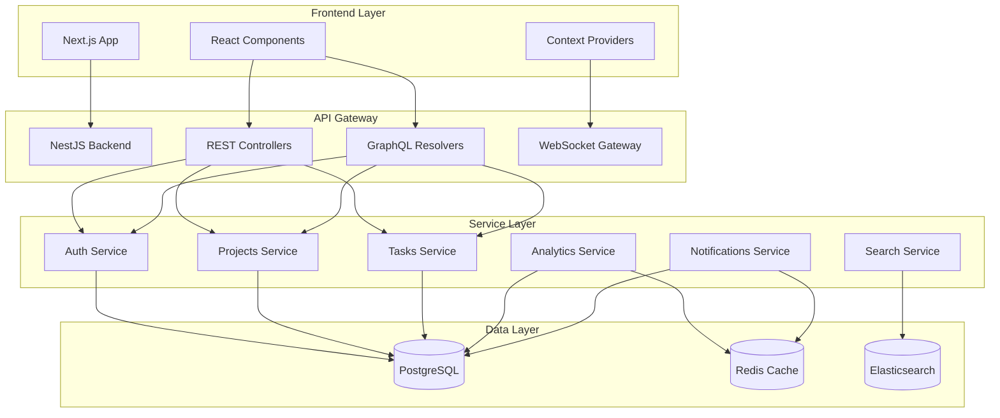

# Project Management Tool

> A comprehensive, enterprise-grade project management solution built with NestJS and Next.js, featuring real-time collaboration, advanced task dependencies, and intelligent analytics.

## 🚀 Features

### Core Functionality
- **Project Management**: Create, organize, and track multiple projects
- **Advanced Task System**: Task dependencies with topological sorting
- **Real-time Collaboration**: WebSocket-based notifications and updates
- **User Management**: Role-based access control (RBAC)
- **Analytics Dashboard**: Project insights and performance metrics
- **Search & Discovery**: Elasticsearch-powered full-text search
- **API Integration**: RESTful APIs and GraphQL support

### Technical Highlights
- **Microservices Architecture**: Modular, scalable backend design
- **Real-time Updates**: Socket.IO integration for live notifications
- **Caching Layer**: Redis for performance optimization
- **Database**: PostgreSQL with TypeORM
- **Authentication**: JWT-based secure authentication
- **Containerization**: Full Docker support for development and production

## 🏗️ Architecture Overview



## 🛠️ Technology Stack

### Backend
- **Framework**: NestJS 10.x
- **Database**: PostgreSQL 15
- **ORM**: TypeORM
- **Cache**: Redis 7
- **Search**: Elasticsearch 8
- **Authentication**: JWT + Passport
- **Real-time**: Socket.IO
- **API**: REST + GraphQL (Apollo)
- **Validation**: class-validator
- **Documentation**: Swagger/OpenAPI

### Frontend
- **Framework**: Next.js 14
- **UI Library**: React 18
- **Styling**: Tailwind CSS
- **State Management**: React Context
- **HTTP Client**: Axios
- **Real-time**: Socket.IO Client
- **Forms**: React Hook Form
- **TypeScript**: Full type safety

### DevOps & Infrastructure
- **Containerization**: Docker & Docker Compose
- **Process Management**: PM2
- **Environment**: Node.js 18+
- **Package Manager**: npm/yarn

## 🚀 Quick Start

### Prerequisites
- Docker & Docker Compose
- Node.js 18+ (for local development)
- Git

### 1. Clone Repository
```bash
git clone <repository-url>
cd Project-Management-Tool
```

### 2. Environment Setup
Create `.env` file in the project root:

```env
# Application
PORT=3001
NODE_ENV=development

# Database
DB_HOST=postgres
DB_PORT=5432
DB_USER=postgres
DB_PASSWORD=postgres
DB_NAME=pmtool

# Redis
REDIS_HOST=redis
REDIS_PORT=6379

# Elasticsearch
ELASTICSEARCH_NODE=http://elasticsearch:9200

# Security
JWT_SECRET=your-super-secret-jwt-key-change-in-production
JWT_EXPIRES_IN=7d

# Frontend
NEXT_PUBLIC_API_URL=http://localhost:3001
NEXT_PUBLIC_WS_URL=http://localhost:3001
```

### 3. Start Services
```bash
# Start all services with Docker Compose
docker compose up --build

# Or start in detached mode
docker compose up --build -d
```

### 4. Initialize Database
```bash
# Health check
curl -X GET http://localhost:3001/api/health

# Seed admin user
curl -X POST http://localhost:3001/api/users/seed-admin \
  -H 'Content-Type: application/json' \
  -d '{"email":"admin@example.com","password":"admin123"}'
```

### 5. Access Applications
- **Frontend**: http://localhost:3000
- **Backend API**: http://localhost:3001/api
- **API Documentation**: http://localhost:3001/api/docs
- **GraphQL Playground**: http://localhost:3001/graphql

### 6. Login
```bash
# Get JWT token
curl -X POST http://localhost:3001/api/auth/login \
  -H 'Content-Type: application/json' \
  -d '{"email":"admin@example.com","password":"admin123"}'
```

## 📁 Project Structure

```
Project-Management-Tool/
├── backend/                 # NestJS Backend Application
│   ├── src/
│   │   ├── modules/        # Feature modules
│   │   │   ├── auth/       # Authentication & Authorization
│   │   │   ├── users/      # User management
│   │   │   ├── projects/   # Project management
│   │   │   ├── tasks/      # Task management with dependencies
│   │   │   ├── notifications/ # Real-time notifications
│   │   │   ├── analytics/  # Analytics and reporting
│   │   │   ├── search/     # Elasticsearch integration
│   │   │   ├── cache/      # Redis caching
│   │   │   └── graphql/    # GraphQL resolvers
│   │   ├── config/         # Configuration files
│   │   ├── app.module.ts   # Root application module
│   │   └── main.ts         # Application entry point
│   ├── Dockerfile          # Production Docker image
│   ├── Dockerfile.dev      # Development Docker image
│   └── package.json        # Backend dependencies
├── frontend/               # Next.js Frontend Application
│   ├── components/         # Reusable React components
│   ├── contexts/          # React Context providers
│   ├── lib/               # Utility functions and API client
│   ├── pages/             # Next.js pages and routing
│   ├── styles/            # Global styles and Tailwind CSS
│   ├── Dockerfile         # Production Docker image
│   └── package.json       # Frontend dependencies
├── docker-compose.yml     # Multi-container Docker setup
├── .env                   # Environment variables
└── README.md             # This file
```

## 🔧 Development

### Local Development Setup

#### Backend Development
```bash
cd backend
npm install
npm run start:dev  # Hot reload development server
```

#### Frontend Development
```bash
cd frontend
npm install
npm run dev       # Next.js development server
```

### Available Scripts

#### Backend Scripts
```bash
npm run start         # Production server
npm run start:dev     # Development with hot reload
npm run start:debug   # Debug mode
npm run build         # Build for production
npm run test          # Run unit tests
npm run test:e2e      # Run end-to-end tests
npm run lint          # ESLint code analysis
```

#### Frontend Scripts
```bash
npm run dev           # Development server
npm run build         # Production build
npm run start         # Start production server
npm run lint          # ESLint code analysis
npm run type-check    # TypeScript type checking
```

### Database Management

#### Migrations
```bash
# Generate migration
npm run migration:generate -- -n MigrationName

# Run migrations
npm run migration:run

# Revert migration
npm run migration:revert
```

#### Database Reset
```bash
# Drop and recreate database
docker compose down -v
docker compose up --build
```

## 🧪 Testing

### Backend Testing
```bash
cd backend

# Unit tests
npm run test

# Test coverage
npm run test:cov

# End-to-end tests
npm run test:e2e

# Watch mode
npm run test:watch
```

### Frontend Testing
```bash
cd frontend

# Run tests
npm run test

# Test coverage
npm run test:coverage
```

## 📊 Monitoring & Observability

### Health Checks
- **Backend Health**: `GET /api/health`
- **Database Health**: `GET /api/health/db`
- **Redis Health**: `GET /api/health/redis`
- **Elasticsearch Health**: `GET /api/health/elasticsearch`

### Logging
- Application logs are available via Docker logs
- Structured logging with Winston (backend)
- Error tracking and monitoring ready

### Performance Monitoring
- Redis caching for frequently accessed data
- Database query optimization with TypeORM
- Elasticsearch for fast search operations

## 🔒 Security

### Authentication & Authorization
- JWT-based authentication
- Role-based access control (RBAC)
- Password hashing with bcrypt
- CORS configuration
- Rate limiting (configurable)

### Security Best Practices
- Environment variable management
- Input validation and sanitization
- SQL injection prevention
- XSS protection
- HTTPS enforcement (production)

## 🚀 Deployment

### Production Deployment

#### Docker Production
```bash
# Build production images
docker compose -f docker-compose.prod.yml build

# Deploy to production
docker compose -f docker-compose.prod.yml up -d
```

#### Environment Variables (Production)
```env
NODE_ENV=production
PORT=3001
DB_HOST=your-production-db-host
DB_PASSWORD=your-secure-password
JWT_SECRET=your-production-jwt-secret
REDIS_HOST=your-redis-host
ELASTICSEARCH_NODE=your-elasticsearch-url
```

### Cloud Deployment Options

#### Backend Deployment
- **Railway**: Easy NestJS deployment
- **Render**: Full-stack deployment
- **AWS ECS**: Container orchestration
- **Google Cloud Run**: Serverless containers
- **DigitalOcean App Platform**: Managed deployment

#### Frontend Deployment
- **Vercel**: Optimized for Next.js
- **Netlify**: JAMstack deployment
- **AWS Amplify**: Full-stack hosting
- **Firebase Hosting**: Google's hosting solution

#### Database & Services
- **PostgreSQL**: AWS RDS, Google Cloud SQL, Supabase
- **Redis**: AWS ElastiCache, Redis Cloud
- **Elasticsearch**: Elastic Cloud, AWS OpenSearch

## 🤝 Contributing

### Development Workflow
1. Fork the repository
2. Create a feature branch: `git checkout -b feature/amazing-feature`
3. Make your changes
4. Run tests: `npm run test`
5. Commit changes: `git commit -m 'Add amazing feature'`
6. Push to branch: `git push origin feature/amazing-feature`
7. Open a Pull Request

### Code Standards
- Follow ESLint configuration
- Use TypeScript for type safety
- Write unit tests for new features
- Update documentation as needed
- Follow conventional commit messages

### Pull Request Guidelines
- Provide clear description of changes
- Include relevant tests
- Update documentation if needed
- Ensure CI/CD passes
- Request review from maintainers

## 📚 API Documentation

### REST API
- **Swagger UI**: http://localhost:3001/api/docs
- **OpenAPI Spec**: http://localhost:3001/api/docs-json

### GraphQL API
- **GraphQL Playground**: http://localhost:3001/graphql
- **Schema Introspection**: Available in playground

### WebSocket Events
- **Connection**: `/notifications`
- **Events**: `task-assigned`, `project-updated`, `notification-received`

## 🐛 Troubleshooting

### Common Issues

#### Port Already in Use
```bash
# Kill process using port 3001
lsof -ti:3001 | xargs kill -9

# Or change port in .env file
PORT=3002
```

#### Database Connection Issues
```bash
# Reset Docker volumes
docker compose down -v
docker compose up --build
```

#### Frontend Build Issues
```bash
# Clear Next.js cache
cd frontend
rm -rf .next
npm run build
```

### Getting Help
- Check existing issues in the repository
- Review logs: `docker compose logs [service-name]`
- Verify environment variables
- Ensure all services are running

## 📄 License

This project is licensed under the MIT License - see the [LICENSE](LICENSE) file for details.

## 🙏 Acknowledgments

- NestJS team for the amazing framework
- Next.js team for the React framework
- All open-source contributors
- Community feedback and suggestions

---

**Built with ❤️ using NestJS and Next.js**